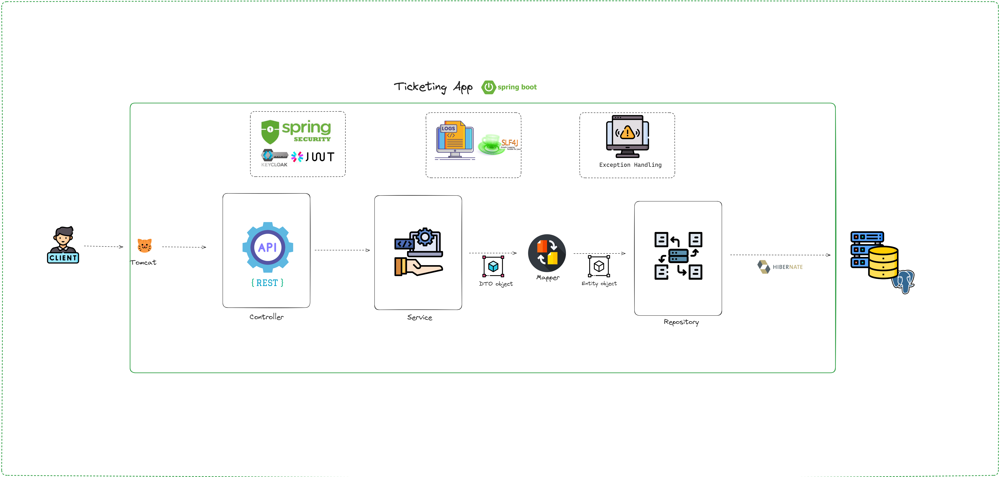

# Project Management Tool - Ticketing Project

### 📖 Information

<ul style="list-style-type:disc">
  <li>This app serves as a versatile
project management solution. At its core, the ticketing app is a powerful project management tool with
three distinct roles: <b>admin, manager, and employee</b>. Each role has specific
privileges and responsibilities.</li> 
  <li>Here is the explanation of roles:
       <ul><b>Admin:</b> Have the authority to create users and initiate new projects,
serving as the backbone of the app's administrative functions.</ul> <ul><b>Manager:</b> Can view their assigned projects and assign tasks to
employees. Their role is essential for overseeing projects and task
delegation.</ul> <ul><b>Employee:</b>  Focus on executing tasks assigned by managers,
contributing to project execution and success.</ul>
  </li>
</ul>

### Technical Information
<ul style="list-style-type:disc">
<li>This Maven-built application uses a three-tier architecture 
with a Controller, Service, and Repository. Followed RESTful principles for 
scalable and maintainable APIs. Implemented PostgreSQL as the database. 
Successfully interacted database using the JPA and Hibernate. Used
OAuth2 security framework for robust security. Keycloak served as the 
authorization server. Enhanced collaboration by documenting API 
endpoints with OpenAPI3. Created integration tests to validate 
functionalities. Efficiently managed cross-cutting concerns by applying 
Aspect-Oriented Programming principles</li>
</ul>

### Technologies

---
- Java 11
- Spring Boot 2.7.16
- Restful API
- Spring data, JPA & Hibernate,
- PostgreSQL
- OAuth2 security framework
- Spring Security
- Keycloak
- Maven
- Junit5
- Mockito
- Unit & Integration Tests
- Docker Compose
- OpenAPI3
- Lombok

---


---
### Business Logics

<ul style="list-style-type:disc">
<li><B>Soft Delete Implementation:</B>
<ul>The system uses a soft delete approach. This ensures that records are not permanently deleted. It protects historical data and maintains data integrity.</ul>
</li>

<li><B>Unique Constraints:</B>
<ul>Made usernames and project codes unique in the system. This prevents duplication and ensures reliable identification.</ul>
</li>

<li><B>Manager Deletion Restriction:</B>
<ul>Managers cannot be deleted if they are assigned to a project. This precaution prevents data loss by keeping managerial associations with ongoing projects.</ul>
</li>

<li><B>Employee Deletion Restriction:</B>
<ul>Cannot delete employees with assigned tasks. This is to keep task data and avoid losing information by mistake.</ul>
</li>

<li><B>Manager Project Completion Authorization:</B>
<ul>Managers can mark a project as completed only if all tasks for the project are also marked as completed. This ensures that projects are considered complete only when all related tasks are successfully finished, keeping a full view of project status.</ul>
</li>

<li><B>Admin Project Completion Authorization:</B>
<ul>When an admin user marks a project as completed, all tasks associated with that project are also marked as completed. This keeps everything consistent and shows how projects and tasks are connected.</ul>
</li>
</ul>


---

<!DOCTYPE html>
<html lang="en">
<head>
  <meta charset="UTF-8">
  <meta name="viewport" content="width=device-width, initial-scale=1.0">
</head>
<body>

<h2>API Documentation</h2>

<table>
  <tr>
    <th>Path</th>
    <th>Method</th>
    <th>Operation</th>
    <th>Request Body</th>
    <th>Parameters</th>
    <th>Responses</th>
  </tr>

  <!-- User Controller -->
  <tr>
    <td>/api/v1/user</td>
    <td>GET</td>
    <td>getUsers</td>
    <td></td>
    <td></td>
    <td>200, 400, 404</td>
  </tr>
  <tr>
    <td>/api/v1/user</td>
    <td>PUT</td>
    <td>updateUser</td>
    <td>UserDTO</td>
    <td></td>
    <td>200</td>
  </tr>
  <tr>
    <td>/api/v1/user</td>
    <td>POST</td>
    <td>createUser</td>
    <td>UserDTO</td>
    <td></td>
    <td>200</td>
  </tr>

  <!-- Task Controller -->
  <tr>
    <td>/api/v1/task</td>
    <td>GET</td>
    <td>getTasks</td>
    <td></td>
    <td></td>
    <td>200</td>
  </tr>
  <tr>
    <td>/api/v1/task</td>
    <td>PUT</td>
    <td>updateTask</td>
    <td>TaskDTO</td>
    <td></td>
    <td>200</td>
  </tr>
  <tr>
    <td>/api/v1/task</td>
    <td>POST</td>
    <td>createTask</td>
    <td>TaskDTO</td>
    <td></td>
    <td>200</td>
  </tr>
  <tr>
    <td>/api/v1/task/employee/update</td>
    <td>PUT</td>
    <td>employeeUpdateTask</td>
    <td>TaskDTO</td>
    <td></td>
    <td>200</td>
  </tr>

  <!-- Project Controller -->
  <tr>
    <td>/api/v1/project</td>
    <td>GET</td>
    <td>getProjects</td>
    <td></td>
    <td></td>
    <td>200</td>
  </tr>
  <tr>
    <td>/api/v1/project</td>
    <td>PUT</td>
    <td>updateProject</td>
    <td>ProjectDTO</td>
    <td></td>
    <td>200</td>
  </tr>
  <tr>
    <td>/api/v1/project</td>
    <td>POST</td>
    <td>createProject</td>
    <td>ProjectDTO</td>
    <td></td>
    <td>200</td>
  </tr>
  <tr>
    <td>/api/v1/project/manager/complete/{projectCode}</td>
    <td>PUT</td>
    <td>completeProject</td>
    <td></td>
    <td>projectCode</td>
    <td>200</td>
  </tr>
  <tr>
    <td>/api/v1/project/{projectCode}</td>
    <td>GET</td>
    <td>getProjectByProjectCode</td>
    <td></td>
    <td>projectCode</td>
    <td>200</td>
  </tr>
  <tr>
    <td>/api/v1/project/{projectCode}</td>
    <td>DELETE</td>
    <td>deleteProject</td>
    <td></td>
    <td>projectCode</td>
    <td>200</td>
  </tr>
  <tr>
    <td>/api/v1/project/manager/project-status</td>
    <td>GET</td>
    <td>getProjectByManager</td>
    <td></td>
    <td></td>
    <td>200</td>
  </tr>

  <!-- Additional Task Controller Endpoints -->
  <tr>
    <td>/api/v1/task/{taskId}</td>
    <td>GET</td>
    <td>getTaskById</td>
    <td></td>
    <td>taskId</td>
    <td>200</td>
  </tr>
  <tr>
    <td>/api/v1/task/employee/pending-tasks</td>
    <td>GET</td>
    <td>employeePendingTasks</td>
    <td></td>
    <td></td>
    <td>200</td>
  </tr>
  <tr>
    <td>/api/v1/task/employee/archive</td>
    <td>GET</td>
    <td>employeeArchiveTasks</td>
    <td></td>
    <td></td>
    <td>200</td>
  </tr>

  <!-- User Controller Additional Endpoints -->
  <tr>
    <td>/api/v1/user/{username}</td>
    <td>GET</td>
    <td>getUserByUsername</td>
    <td></td>
    <td>username</td>
    <td>200</td>
  </tr>
  <tr>
    <td>/api/v1/user/{username}</td>
    <td>DELETE</td>
    <td>deleteUser</td>
    <td></td>
    <td>username</td>
    <td>200</td>
  </tr>

  <!-- Additional Task Controller Endpoint -->
  <tr>
    <td>/api/v1/task/{id}</td>
    <td>DELETE</td>
    <td>deleteTask</td>
    <td></td>
    <td>id</td>
    <td>200</td>
  </tr>
</table>

</body>
</html>


### Prerequisites

---
- Maven or Docker
---


### Docker Run

The application can be built and run by the `Docker` engine. 

Please follow directions shown below in order to build and run the application with Docker Compose file;

```
$ cd My-ticketing-project-REST
$ docker-compose up -d
```

If you change anything in the project and run it on Docker, you can also use this command shown below

```sh
$ cd My-ticketing-project-REST
$ docker-compose up --build
```

---
### Maven Run
To build and run the application with `Maven`, please follow the directions shown below;

```sh
$ cd My-ticketing-project-REST
$ mvn clean install
$ mvn spring-boot:run
```


### Creator

- [Muhammed Ihsan SOLAK](https://github.com/muhammedihsansolak)
